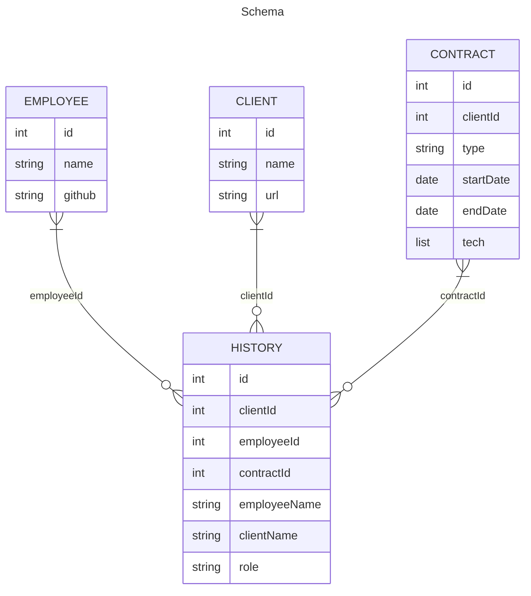

# simple-tracker
Skeleton structure for a work tracking web app in vanilla javascript. Meant to be forked and  extended

## features
- api server
- fronted

## does not feature
- authentication
- styling
- input validation
- gui elements for modifying/deleting data
- database
- tests
- ci/cd automation

